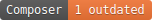
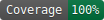
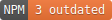
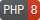

# Support Page







This version of the Support Page Library is designed to work with Bulma views.

Use this library to add the following to your Project:

* Admin access to create, edit and delete Support Details.
* A Support Page to display Support Details.

## What's in the box?

* Laravel 11 Blade Support Page Admin Access in the Bulma Design
* Laravel 11 Blade Support Page in the Bulma Design
* PHP 8.3

## Installation

Via Composer: `composer require networkrailbusinesssystems/support-page dev-bulma`

## Publish files

All essential files are published via the command `php artisan vendor:publish --provider="NetworkRailBusinessSystems\SupportPage\Providers\SupportPageProvider" --tag="support-page"`.

This command includes the support-page tag files:

### support-page

This command will publish the config and database migration:

* /config/support-page.php
* /database/migrations/2023_00_00_000000_create_support_details_table.php

### support-page-views

This command will publish the Blade views:

* /resources/views/details
* /resources/views/show.blade.php

## Set-up

### Pre-requisites

The Support Page library requires the [GOVUK Laravel Forms Route Macro](https://github.com/AnthonyEdmonds/govuk-laravel/blob/main/docs/forms.md).

### Routing
A route macro is provided to handle the Support Page, and it's Admin functions. Add the following to your `routes/web.php` file:
```php
Route::supportPage();
```

* Add the permission`'manage_support_page'` with admin rights.
* Add a 'Manage Support Details' link to the admin blade with the route `support-page.admin.index` and wrap the section with `@can`:
```php
@can('manage_support_page')
    <li>
        <x-govuk::a href="{{ route('support-page.admin.index') }}">
            Manage Support Details
        </x-govuk::a>
    </li>
@endcan
```

* Register the form `SupportDetailForm::class` in the [GOVUK Config](https://github.com/AnthonyEdmonds/govuk-laravel/blob/main/docs/configuration.md).
* Update permissions and run database migrations.

## Configuration

There are three configurable values in the Support-page config:

| Option             | Type               | Default      | Usage                                                                  |
|--------------------|--------------------|--------------|------------------------------------------------------------------------|
| support_page_title | string             | Support      | Customise the title of the support page                                |
| excluded_roles     | array              | []           | Exclude these roles from being assignable contacts for Support Details |
